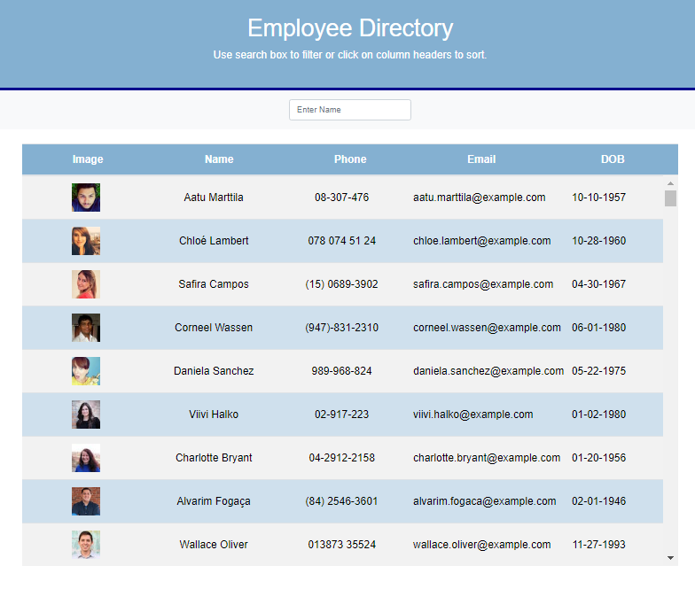

# Employee Directory

[](https://opensource.org/licenses/MIT) 

 


  ---
  
<p>&nbsp;<p>

## Description

This a React app that lets the user view a list of employees, search for a specific employee, and sort the employees by either name, phone, email or DOB. When you search for an employee it will immediately give the user a result and clicking on the table header will sort the employees either in ascending or descending order.

This project had the following criteria:

Utilizing this app, the user will be able to search and sort a list of employees. 

<p>&nbsp;<p>

## Table of Contents
* [Installation](#installation)
* [Usage](#usage)
* [License](#license)
* [Contributing](#contributing)

<p>&nbsp;<p>

## Installation

To install dependencies when executing on localhost, run the following:

```
npm i
```

### Built with
* Javascript
* [React](https://www.npmjs.com/package/react/)
* [npm](https://nodejs.org/en/)
* [npm axios](https://www.npmjs.com/package/axios)
* [npm gh-pages](https://www.npmjs.com/package/gh-pages)
* [Visual Studio Code](code.visualstudio.com)

<p>&nbsp;<p>

## Usage

To run on localhost:

```
npm start
```

### Github Link
[Employee Directory Github Link](https://drclever.github.io/Employee-Directory/)

1. Navigate to https://drclever.github.io/Employee-Directory/ or http://localhost:3000
2. Enter name (first or last).  The user will see the table start to filter.
3. Click on table heading (Name, Phone, Email, DOB).  The user will see that the table is sorted by that heading ascending or descending.  Please note:  Clicking on Name heading will sort the Name by last name.


### Sample Screenshot



<p>&nbsp;<p>

## License

This repository is licensed under the MIT License.
[](https://opensource.org/licenses/MIT)

<p>&nbsp;<p>

## Contributing

This repository is a homework project and is not accepting contributions.
